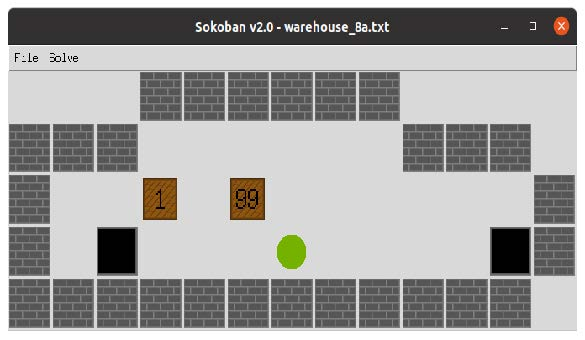
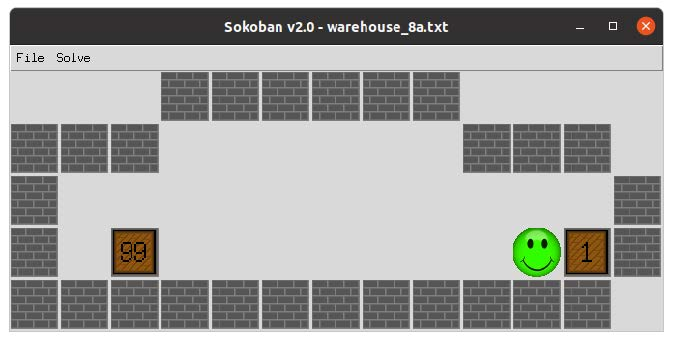

# Motion Planning in a Sokoban Warehouse using A* Graph Search

## Overview

**Sokoban** is a computer puzzle game in which the player pushes boxes around a maze in order to place them in designated locations.

The screen-shot below shows the GUI provided for the project. While Sokoban is just a game, it models a robot moving boxes in a warehouse and as such, it can be treated as an automated planning problem. Sokoban is an interesting challenge for the field of artificial intelligence largely due to its difficulty. Sokoban has been proven NP-hard. Sokoban is difficult not because of its branching factor, but because of the huge depth of the solutions. Many actions (box pushes) are needed to reach the goal state! However, given that the only available actions are moving the worker up, down, left or right, the branching factor is small (only 4).

The worker can only push a single box at a time and is unable to pull any box. The boxes have individual weights. The weight of a box is taken into account when computing the cost of a push. The cost of an action is 1 + weight of the box being pushed (if any). That is, if the worker moves to an empty cell the action cost is 1. If the worker pushes a box that has a weight of 7, the action cost is 8 = 1+7.

*Initial state of a warehouse. The green disk represents the agent/robot/player, the brown squares represent the boxes/crates. The black cells denote the target positions for the boxes. The left box has a weight of 1. The right box has a weight of 99.*

*Goal state reached: all the boxes have been pushed to a
target position. Notice that the light box (weight of 1) has been moved to the target that was initially the farthest.*

## Warehouse Representation in Text Files

The puzzles and their initial state are coded as follows in the text files:

- space = a free square
- `#` = a wall square
- `$` = a box
- `,` = a target square
- `@` = the player
- `!` = the player on a target square
- `*` = a box on a target square

## File Directories

- `search.py`: contains a number of search algorithms and related classes.
- `sokoban.py`: contains a class Warehouse that allows you to load puzzle instances from text files.
- `sokoban_gui.py`: a GUI implementation of Sokoban that allows you to play and explore puzzles. This GUI program can call the planner function solve_weighted_sokoban
- `mySokobanSolver.py`: solver using heuristic search.
- `sanity_check.py`: script to perform very basic tests on mySokobanSolver.py.
- `warehouses/`: a number of warehouse puzzles.

## Final Report

Available for read here: [report](report.pdf), containing the following sections:
- Section 1: formuation of sokoban puzzle solver (initial state, goal state, actions, transition model, action cost, heuristic cost)
- Section 2: Test Methodology
- Section 3: Performance and Limitations (Impact of warehouse space on solver performance, search algorithm analysis and comparison - uniform cost search vs A-star graph search)